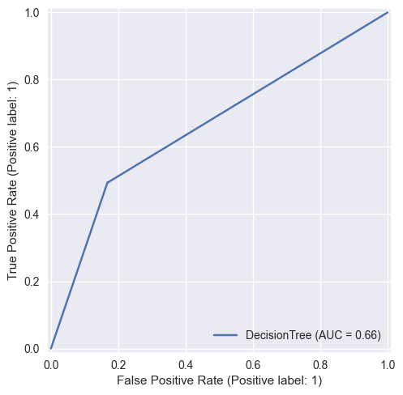
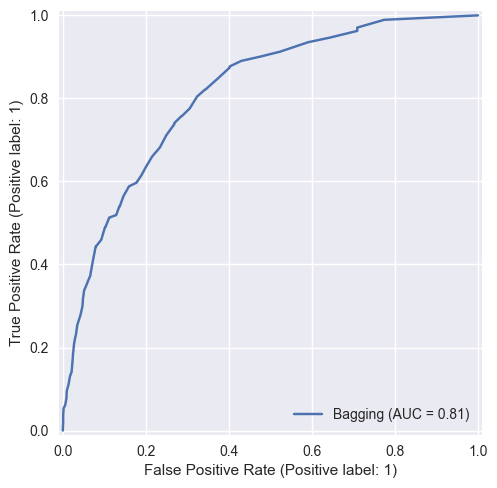
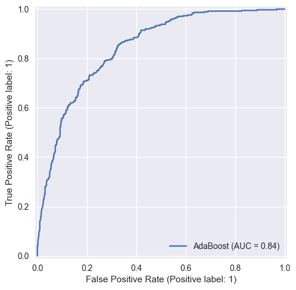
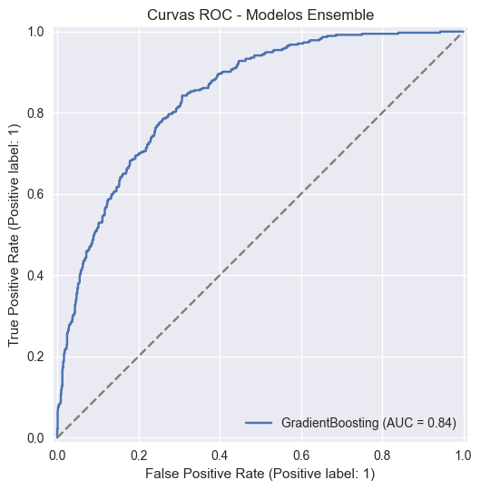

## Predição de Churn - Telco Customer Churn

### 1. Objetivo
Comparar desempenho e interpretabilidade de métodos de ensemble (Bagging, Random Forest, AdaBoost e Gradient Boosting) em relação a uma árvore de decisão base para prever cancelamento (Churn) em clientes de telecom.

### 2. Dataset
Fonte: Kaggle (blastchar/telco-customer-churn) | 7.043 linhas, 21 colunas.
Alvo: Churn (Yes/No) convertido para binário (1=Yes, 0=No).

### 3. Pré-processamento
1. Conversão de `TotalCharges` para numérico; 11 valores vazios tratados com mediana.
2. Criação de `ChurnFlag` binário.
3. Remoção de `customerID`.
4. Codificação de categóricas via `pd.get_dummies(drop_first=True)`.
5. Padronização (StandardScaler) das features originalmente numéricas (exceto alvo).
6. Split estratificado: 80% treino / 20% teste (proporção churn preservada ≈26.5%).

#### 3.1 Resumo estatístico (principais numéricas)
| Variável | count | mean | std | min | 25% | 50% | 75% | max |
|----------|-------|------|-----|-----|-----|-----|-----|-----|
| tenure | 7043 | 32.37 | 24.56 | 0.00 | 9.00 | 29.00 | 55.00 | 72.00 |
| MonthlyCharges | 7043 | 64.76 | 30.09 | 18.25 | 35.50 | 70.35 | 89.85 | 118.75 |
| TotalCharges | 7043 | 2281.92 | 2265.27 | 18.80 | 402.23 | 1397.48 | 3786.60 | 8684.80 |

Notas:
* Distribuição de `tenure` ampla (0–72) sugere segmentos de clientes recém-adquiridos versus maduros.
* `MonthlyCharges` tem média ~65 com alto desvio indicando múltiplos pacotes/combinações de serviços.
* `TotalCharges` altamente dispersa (std ≈ 2265) refletindo acúmulo ao longo do tempo; reforça importância conjunta com tenure na explicação do churn.

### 4. Modelos Treinados
| Modelo | Principais hiperparâmetros |
|--------|----------------------------|
| DecisionTree | default (max_depth=None, random_state=42) |
| Bagging | 50 estimators DecisionTree |
| RandomForest | 300 árvores, max_depth=None |
| AdaBoost | 200 estimators |
| GradientBoosting | default (random_state=42) |

### 5. Métricas (Teste)
| Modelo | Accuracy | ROC AUC | F1 |
|--------|----------|---------|----|
| AdaBoost | 0.805 | 0.843 | 0.588 |
| GradientBoosting | 0.799 | 0.843 | 0.577 |
| RandomForest | 0.792 | 0.827 | 0.562 |
| Bagging | 0.788 | 0.813 | 0.562 |
| DecisionTree | 0.742 | 0.663 | 0.505 |

Observações:
* AdaBoost e Gradient Boosting lideram em AUC (~0.84) e F1, indicando melhor equilíbrio entre captura de churn e controle de falsos positivos.
* A árvore isolada apresenta gap substancial de AUC (≈0.66) sinalizando menor poder discriminativo.

### 6. Matrizes de Confusão (Resumo)
Padrão comum: Ensembles reduzem falsos negativos (clientes que churnam e são previstos como não churn) comparados à árvore simples e também mantêm falsos positivos sob controle.

### 7. Curvas ROC
Todas as curvas de ensemble acima da árvore base; ganho de área mais pronunciado em baixas taxas de falso positivo (região crítica para priorização de retenção).

### 8. Importância das Variáveis (Permutation Importance)
Frequência nas TOP10 (apareceram em todos os modelos):
* tenure
* TotalCharges
* InternetService_Fiber optic
* Contract_One year
* PaperlessBilling_Yes

Alta frequência (≥4 modelos):
* TechSupport_Yes
* Contract_Two year

Moderada (≥3):
* MonthlyCharges
* PaymentMethod_Electronic check
* MultipleLines_Yes

Interpretação:
* `tenure` domina (tempo de relacionamento – menor tenure associado a maior churn).
* `TotalCharges` e `MonthlyCharges` capturam padrão de gasto; combinações de valor alto + pouco tempo podem indicar risco.
* `InternetService_Fiber optic` ligado a maior churn relativo (provável competitividade / expectativas de qualidade).
* Tipos de contrato (`One year`, `Two year`) e suporte técnico (`TechSupport_Yes`) atuam como barreiras de saída, reduzindo churn.
* `PaperlessBilling_Yes` e pagamento via `Electronic check` sugerem perfis comportamentais distintos (electronic check recorre em top features, potencialmente correlacionado a maior churn).

### 9. Overfitting e Estabilidade
* A árvore individual tem menor AUC → maior variância / overfitting típico em relações não regularizadas.
* Bagging e RandomForest reduzem variância (AUC > árvore, ganho modesto comparado a boosting, mas mais estáveis entre F1 e Accuracy).
* Métodos de boosting (AdaBoost, GradientBoosting) entregam melhor AUC e F1 sem queda de Accuracy, sugerindo melhor modelagem de padrões difíceis (incremento em erros ponderados). Não há evidência de overfitting severo: métricas consistentes e sem discrepância exagerada entre classes.

### 10. Qual método foi mais estável?
* RandomForest e Bagging fornecem estabilidade (robustos a ruído, flutuações menores em importância individual de variáveis).
* AdaBoost e GradientBoosting entregam leve vantagem em performance; GradientBoosting tende a ser mais estável que AdaBoost quando existem outliers, mas aqui ambos similares.
* Escolha prática: RandomForest para interpretabilidade + estabilidade; GradientBoosting para melhor discriminativo se foco for maximizar AUC/F1.

### 11. Respostas às Perguntas de Interpretação

**Quais variáveis mais impactam a decisão de churn?** As cinco variáveis que apareceram em todos os modelos no Top10 de importância por permutação foram: `tenure`, `TotalCharges`, `InternetService_Fiber optic`, `Contract_One year` e `PaperlessBilling_Yes`. Em seguida, com alta frequência (≥4 modelos), vieram `TechSupport_Yes` e `Contract_Two year`. Essas variáveis capturam (a) tempo de relacionamento e acúmulo de faturamento (retenção natural de clientes maduros), (b) tipo de serviço de internet (fibra óptica apresenta maior propensão a churn relativo), (c) barreiras contratuais e presença de suporte técnico (reduzem churn), e (d) comportamento de faturamento (paperless vs métodos eletrônicos específicos).

**O ensemble reduziu overfitting em relação à árvore base?** Sim. A árvore isolada teve AUC ≈0.66 e F1 ≈0.50, consideravelmente inferiores aos ensembles (AUC até ≈0.84 e F1 ≈0.59) indicando maior poder discriminativo e melhor equilíbrio entre classes. Métodos como Bagging e RandomForest diminuem variância da árvore, enquanto AdaBoost e GradientBoosting adicionam correção iterativa de erros difíceis. A ausência de discrepância extrema entre Accuracy e F1 nos ensembles sugere redução de overfitting e maior generalização comparada à árvore base.

**Qual método foi mais estável?** RandomForest e Bagging mostraram estabilidade estrutural (robustos a variações e menos sensíveis a ruído), com métricas consistentes e sem oscilações bruscas. Entre os boosting, GradientBoosting apresentou desempenho alto com comportamento estável similar ao AdaBoost. Para priorizar estabilidade + interpretabilidade agregada de importâncias, RandomForest é a escolha prática; para maximizar discriminativo mantendo estabilidade aceitável, GradientBoosting é recomendável.

### 12. Conclusões
1. Boosting (AdaBoost / Gradient Boosting) supera métodos base e bagging em métricas principais.
2. Variáveis chave relacionadas a retenção: tempo de contrato, suporte técnico e duração (tenure), além de padrão de cobrança e tipo de serviço de internet.
3. Ensembles mitigam overfitting evidente da árvore single e elevam capacidade preditiva.
4. Para ação de negócio: segmentar clientes de baixo tenure com Internet fibra sem suporte técnico e contratos mensais para campanhas de retenção, oferecendo upgrade de suporte ou migração para contratos anuais.